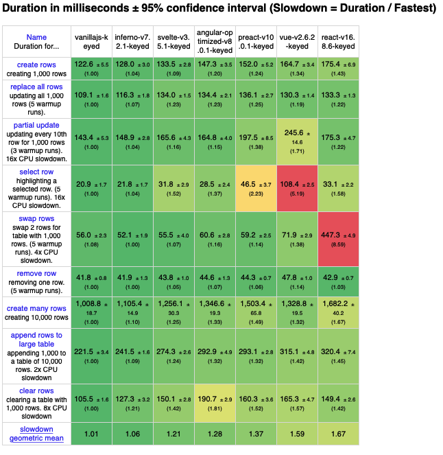
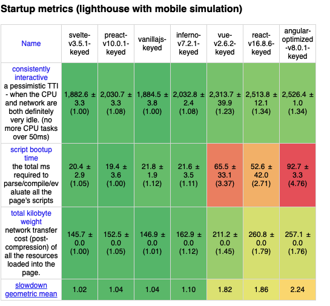
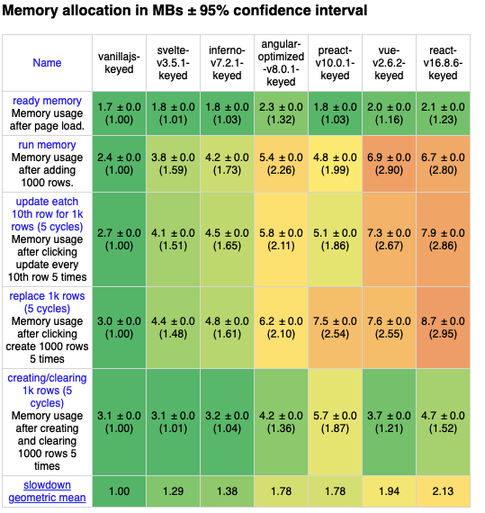

# Svelte

[Svelte](https://github.com/sveltejs/svelte)是一款的前端库，作者 Rich Harris。2020 年在 React/Vue/Angular 三分天下的局面下，Svelte 又有何特色，本文将做简单分析及评测。

## 主要特点

- Write less, Do more
- 没有虚拟 dom
- 无需额外状态管理，内置响应式

详细介绍请参考[官方文档](https://svelte.dev/)。

## 评测

1. Js-framework-benchmark
   
   
   

2. SSR 性能对比
   在选用框架或库的时候，对 ssr 的支持也是重要考量。本次评测，React 选择 Next.js，Vue 选用 Nuxt.js，Angular 用官方的 ssr 教程，Svelte 选取官方支持的 Sapper.js 来做本次 ssr 性能测试

| React/Next | Vue/Nuxt | Angular/Angular-SSR | Svelte/Sapper |
| ---------- | -------- | ------------------- | ------------- |
|            |          |                     |               |
|            |          |                     |               |
|            |          |                     |               |

3. Bundle 体积

## 总结

优点：
缺点：

